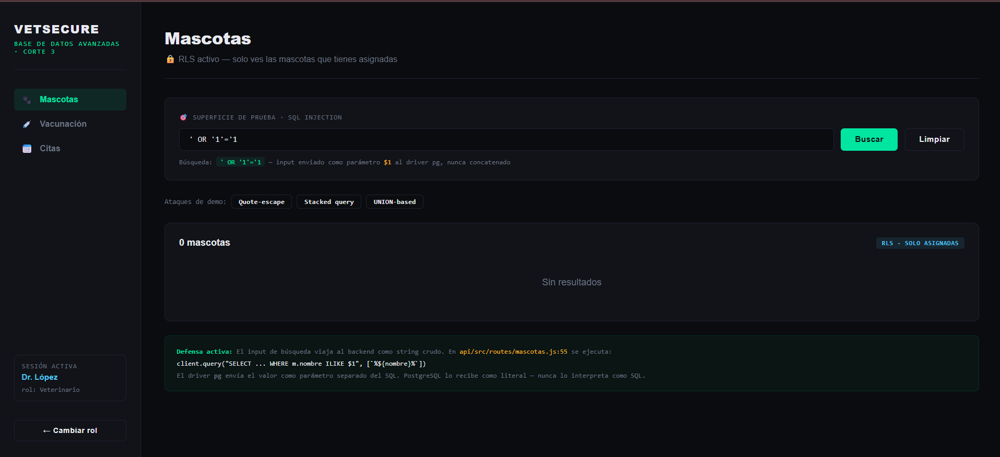
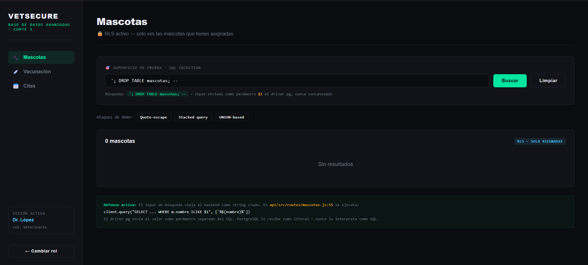
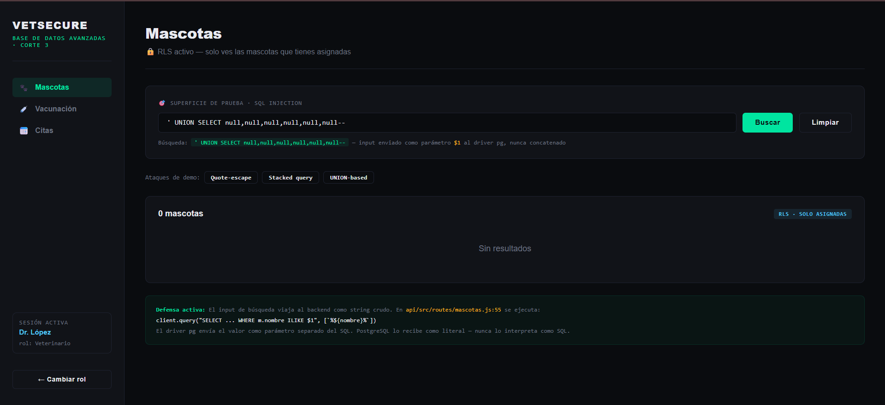
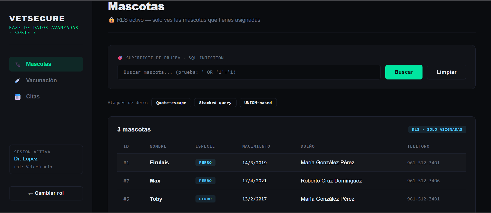
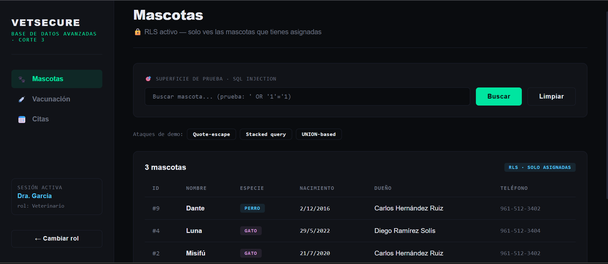
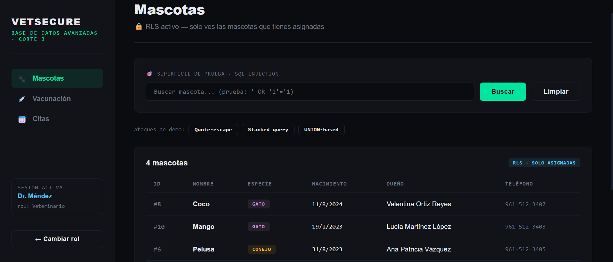

# Cuaderno de Ataques — Corte 3

**Sistema:** Clínica Veterinaria VetSecure  
**Stack:** PostgreSQL 16 · Redis 7 · Node.js (Express) · Next.js  
**Fecha de documentación:** Abril 2026

---

## Sección 1 — Tres ataques de SQL Injection que fallan

### Ataque 1 — Quote-escape clásico

**Pantalla:** `/mascotas` — campo de búsqueda de mascotas

**Input exacto probado:**
```
' OR '1'='1
```

**Qué se esperaría sin defensa:**  
La query construida por concatenación quedaría:
```sql
SELECT ... FROM mascotas WHERE nombre ILIKE '%' OR '1'='1%'
```
Lo cual retornaría todas las filas de la tabla sin importar el rol, saltando RLS.

**Resultado real:**  
El sistema retorna 0 resultados (o solo los asignados al veterinario). El string `' OR '1'='1` se busca literalmente como nombre de mascota.

**Respuesta:**

Sin errores ni filas inesperadas. La query ejecutada en BD fue:
```sql
SELECT ... WHERE m.nombre ILIKE $1   -- $1 = "%' OR '1'='1%"
```

**Línea exacta de defensa:**  
`API/src/routes/mascotas.js` 
```javascript
sql    = `SELECT ... WHERE m.nombre ILIKE $1`;
params = [`%${nombre}%`];
```
El driver `pg` envía el valor como parámetro de tipo `text` en el protocolo wire. PostgreSQL lo recibe como literal, nunca lo evalúa como SQL.

---

### Ataque 2 — Stacked query (intento de DROP TABLE)

**Pantalla:** `/mascotas` 

**Input exacto probado:**
```
'; DROP TABLE mascotas; --
```

**Qué se esperaría sin defensa:**  
Una concatenación directa generaría dos statements:
```sql
SELECT ... WHERE nombre ILIKE '%'; DROP TABLE mascotas; --%'
```
El segundo statement borraría la tabla entera.

**Resultado real:**  
El sistema retorna 0 resultados. La tabla `mascotas` sigue intacta. El driver `pg` de Node.js no soporta múltiples statements en una sola llamada a `client.query()` por defecto — envía el string al servidor como un único statement parametrizado. El `;` y el `DROP` llegan como parte del valor `$1`, no como SQL separado.

**Respuesta:**

La tabla sigue existiendo tras el ataque.

**Línea exacta de defensa:**  
`API/src/routes/mascotas.js` — **línea 55** (misma que Ataque 1)  
Además, el driver `pg` de Node.js deshabilita stacked queries por diseño en `client.query()`. Para múltiples statements se requiere explícitamente `client.query()` con punto y coma entre statements Y fuera del modo parametrizado. Como usamos `$1`, nunca se llega a ese modo.

---

### Ataque 3 — UNION-based (intento de leer otras tablas)

**Pantalla:** `/mascotas` — campo de búsqueda

**Input exacto probado:**
```
' UNION SELECT id,cedula,nombre,NULL,NULL,NULL FROM veterinarios --
```

**Qué se esperaría sin defensa:**  
Una concatenación generaría:
```sql
SELECT ... FROM mascotas WHERE nombre ILIKE '%'
UNION SELECT id,cedula,nombre,NULL,NULL,NULL FROM veterinarios --'
```
Esto inyectaría las cédulas de los veterinarios en los resultados.

**Resultado real:**  
0 resultados. El string completo se busca como nombre de mascota. No hay ningún `UNION` en el SQL ejecutado; el input llegó a PostgreSQL como el string literal `%' UNION SELECT...%` comparado contra la columna `nombre`.

**Resultado:**


**Línea exacta de defensa:**  
`API/src/routes/mascotas.js` — **línea 55**  
Adicionalmente, aunque el ataque superara la parametrización (imposible), RLS en PostgreSQL solo mostraría mascotas asignadas al veterinario activo — una segunda capa de contención.

---

## Sección 2 — Demostración de RLS en acción

### Setup

Los datos de prueba del schema ya incluyen la distribución requerida:

| vet_id | Veterinario         | Mascotas asignadas            |
|--------|---------------------|-------------------------------|
| 1      | Dr. Fernando López  | Firulais (1), Toby (5), Max (7) |
| 2      | Dra. Sofía García   | Misifú (2), Luna (4), Dante (9) |
| 3      | Dr. Andrés Méndez   | Rocky (3), Pelusa (6), Coco (8), Mango (10) |

### Demostración

**Resultado para Dr. López:** `[Firulais, Toby, Max]`


**Resultado para Dra. García:** `[Misifú, Luna, Dante]`


**Resultado para Dr. Méndez:** `[Coco, Mango, Pelusa]`



**Política RLS que produce este comportamiento:**
```sql
CREATE POLICY pol_mascotas_vet ON mascotas
    FOR SELECT TO veterinario
    USING (
        id IN (
            SELECT mascota_id FROM vet_atiende_mascota
             WHERE vet_id = current_setting('app.current_vet_id', true)::INT
               AND activa = TRUE
        )
    );
```
---

## Sección 3 — Demostración de caché Redis

### Demostración
https://drive.google.com/file/d/1o-iXBtwMIVtx-NjpR9EpRMaJUVsFQxLo/view?usp=sharing 

- En el intervalo de 0:01 - 0:05, el sistema muestra CACHE MISS. La latencia es de 130ms porque la API tuvo que consultar la base de datos PostgreSQL.

- En el intervalo de 0:06 - 0:10, el sistema cambia a CACHE HIT (color verde). La latencia cae a 7ms, lo que representa una mejora de velocidad de casi el 2000% al recuperar los datos de la memoria RAM de Redis.

### Explicación
- **Key**: clinica:vacunacion_pendiente.
- **TTL**: 300 segundos (5 minutos).
- **Invalidación**: El video demuestra que el caché se mantiene hasta que una acción de escritura (como aplicar una vacuna) dispara la función invalidateVacunacionCache() en el backend, forzando un nuevo MISS para actualizar los datos.

**Carga de Caché** `API/src/routes/vacunas.js`,
```javascript
// en GET /pendientes
// Intentar obtener desde Redis
const cached = await getVacunacionCache();
if (cached) {
  return res.json({ data: cached, source: 'cache' });
}

// Si falla, consultar PostgreSQL
const result = await client.query('SELECT * FROM v_mascotas_vacunacion_pendiente');

// Guardar en Redis para la próxima consulta
await setVacunacionCache(result.rows);
```

**Lógica de Caché** `API/src/cache.js`,
```javascript
const VACUNACION_KEY = 'clinica:vacunacion_pendiente';
const VACUNACION_TTL = 300;

async function setVacunacionCache(data) {
  // Guarda el resultado como string JSON con expiración automática
  await redis.setex(VACUNACION_KEY, VACUNACION_TTL, JSON.stringify(data));
}
```

**Código de invalidación** `API/src/routes/vacunas.js`,
```javascript
// POST /aplicar
// Se registra la vacuna en la base de datos
await client.query('INSERT INTO vacunas_aplicadas ...', [mascota_id, ...]);
await client.query('COMMIT');

// Se borra el caché para forzar un MISS en la siguiente consulta
await invalidateVacunacionCache();
```
